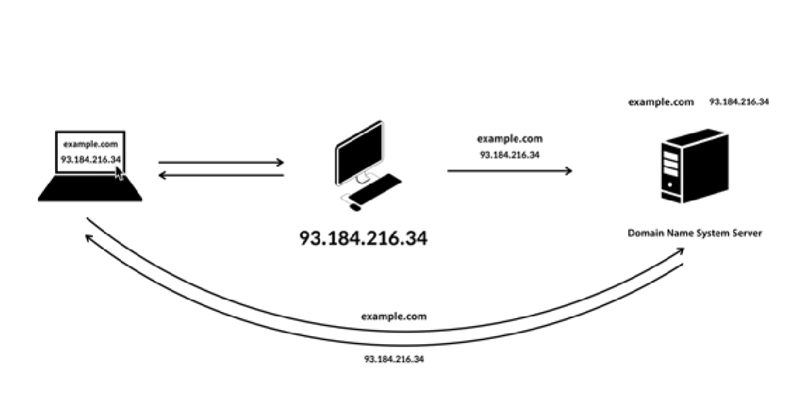
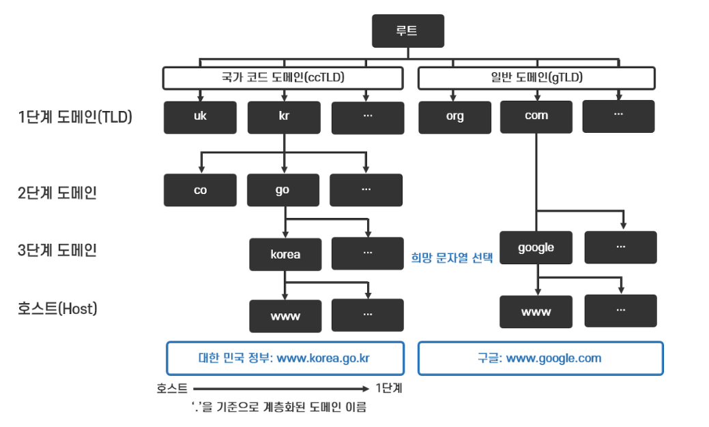

 

# DNS와 작동 원리

## 목차

 

1. [DNS란?](#-DNS란?)
2. [DNS는 왜 생겨났는가?](#-DNS는-왜-생겨났는가?)
3. [DNS는 어떻게 작동하는가](#-DNS는-어떻게-작동하는가)
4. [참고](#-참고)

 

---

## DNS란?

 

> - DNS (Domain Name System)  
>
> 1. 네트워크에서 도메인이나 호스트 이름을 숫자로 된 IP 주소로 해석해주는 TCP/IP 네트워크 서비스이다.

 

역시 백과사전은 펴는 게 아니다. 당연하게 용어들이 쏟아진다. 이럴 때는 정의를 하나하나 파고 들어가는 것도 좋은 방법이지만, 이 개념이 태동한 이유에 대해서 파악하는 것도 좋은 방법이다. 아무래도 왜 생겼는지를 알면 활용 방법도 생각해 볼 수 있으니까.

 

---

 

## DNS는 왜 생겨났는가?

 

사실 DNS가 왜 생겨 났는지는 '인터넷은 어떻게 작동하는가' 포스트에서 간략하게 설명했었다. 그 때 얘기했던 것을 간략하게 설명하자면

모든 기기와 데이터는 식별의 개념으로 IP라는 주소가 있다. 따라서 내가 원하는 정보를 파악하려면 해당 정보의 IP를 알아야 한다. 하지만 IP는 더럽게 생겼기 때문에 이를 하나하나 외울 수는 없다. 해서 IP를 인간이 알아볼 수 있는 언어로 만든 것이 '도메인 네임'이다. 그리고 이러한 도메인 네임을 저장해 놓은 서버가 바로 '도메인 네임 시스템 서버'이다.

 

---

 

## DNS는 어떻게 작동하는가?

 

    

 

먼저 example.com 이라는 사이트를 누가 만들었다고 하자. example.com 이라는 사이트에 누군가가 찾아오려면 example.com의 IP를 도메인 네임 시스템 서버에 저장해야 한다. 저장이 되었다면 이제 고객들은 복잡한 숫자 대신 example.com 이라는 비교적 알아 먹기 쉬운 언어로 해당 웹페이지를 찾을 것이다.

자 이제 위치를 바꿔 우리가 example.com 이라는 사이트에 접속하고 싶다면 도메인 주소를 저장하고 있는 도메인 네임 시스템 서버에 example.com에 해당하는 IP주소를 보내달라고 요청한다. 그러면 도메인 네임 시스템 서버는 해당 IP를 우리 컴퓨터에 보내게 된다. 이제 우리는 우리가 원하는 웹페이지의 IP주소를 알게 되었고 해당 주소를 요청하면 example.com이 우리 브라우저 상에 출력될 것이다.

 

---

 

## 도메인의 계층 구조

 

www.naver.com을 컴퓨터에 쳤을 때 어떤 일이 일어나는지 대략적으로 알아 봤다. 이제는 저 이름이 어떤 구조를(규칙을) 가지고 만들어지는지 알아 보자.

먼저 도메인은 숫자와 영문자의 조합으로만 구성되어야 한다. 특수문자는 사용할 수 없고 256자 이상의 이름은 등록이 불가능하다. 
(한글로 되어 있는 도메인 이름은 한글 도메인 이름을 본래의 도메인으로 바꿔주는 작업을 거친다.)

 

세상에는 정말 다양한 웹 페이지들이 있기에 이들을 관리하기 위해서는 위의 규칙들만으로는 부족하다. 그래서 생긴 것이 도메인 계층 구조다.

 

    

 

위 그림에서 보이는 것처럼 도메인 이름은 몇 개의 짧은 영문자들을 '.'으로 연결한 계층 구조를 갖고 있다.
(참고로 도메인 계층 구조는 나무를 거꾸로 한 것 같은 모양이라는 이름의 '역 트리 구조'라고 하며 해당 구조의 정점을 루트(root)라고 한다.

루트 밑으로 갈라지는 가지는 'kr'과 같이 국가를 나타내는 <strong>국가 코드 도메인</strong>과 'com'과 같이 등록인의 목적에 따라 사용되는 <strong>일반 도메인</strong>을 통틀어서 <strong>1단계 도메인(최상위 도메인, 탑레벨 도메인)</strong>이라고 한다.

1단계 도메인의 하위 도메인인 2단계 도메인(또는 서브 도메인)에는 조직의 속성을 구분하는 'co'(영리 기업), 'go'(정부 기관), 'ac'(대학)과 같은 도메인이 있다.

그 밑의 3단계 도메인은 조직, 서비스의 이름을 나타내는 도메인 이름으로 도메인 사용자가 원하는 이름이 나타나 있다.

각 계층의 도메인 이름은 하위 계층의 정보가 상위 계층에 저장되어 있다. 즉, 루트에는 모든 해당 도메인의 모든 정보가 담겨져 있다.

 

---

 

## DNS 서버의 질의 과정

 

    

이제 계층 구조도 알았으니 위에서 간단하게 알아 본 DNS 서버 질의 과정을 좀 더 자세하게 알아 보자.

 

> 1 사용자가 도메인 이름 www.google.com을 입력하면 사용자의 컴퓨터는 DNS 서버에게 도메인 이름 www.google.com의 IP 주소를 문의한다. DNS 서버는 IP 주소를 알고 있는 루트 네임 서버에 IP주소를 조회한다.

> 2 'com' 정보를 등록하고 있는 루트 네임 서버는 'www.google.com'의 IP 주소를 'com' 네임 서버에 문의하라고 DNS 서버에게 'com' 네임 서버의 IP 주소를 알려 준다.

> 3 DNS 서버는 루트 네임 서버가 알려준 'com' 네임 서버의 IP 주소로 'com' 네임 서버에게 'www.google.com'의 IP 주소를 질의해서 'google.com' 네임 서버의 IP 주소를 얻는다.

> 4 최종적으로 DNS 서버는 'google.com' 네임 서버에 질의해서 www.google.com의 IP 주소를 얻어 사용자의 컴퓨터에 www.google.com의 IP 주소를 알려 준다.

 

매번 이렇게 트리 구조를 따라가는 것은 비효율적이다. 그래서 DNS 서버는 질의한 정보를 한동안 캐시(cache)에 저장하여 같은 질의가 들어오면 루트 네임 서버에 질의하지 않고 바로 IP 주소를 알려 준다.

 

---

 

### 용어 정리

 

> 캐시?

 

캐시란 자주 사용하는 데이터나 값을 미리 복사해 놓는 임시 장소이다.

 

---

 

## 참고

 

> 생활코딩, WEB2-Domain Name System-6.DNS의 원리 https://www.youtube.com/watch?v=iM07I1X7qkg  
> 변계사 Sam의 테크 스타트업, 쉽게 이해하는 네트워크 15. 도메인 의미와 계층 구조 및 DNS 네임 서버(ft. 도메인의 가치) https://better-together.tistory.com/128
