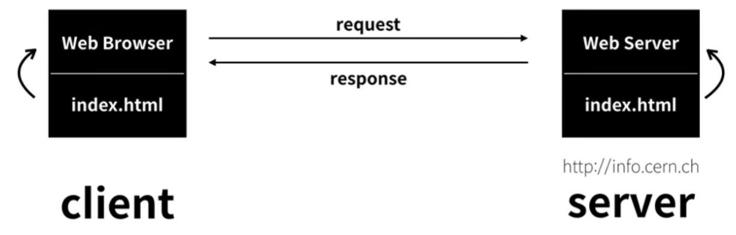

# http란 무엇일까?

 

## 목차

 

1. [http란?](#-http란?)
2. [현실에서의 http](#-현실에서의-http)

 

---

 

## http란?

 
일단 http의 약자를 풀어보면 다음과 같다.

 

> - HyperText Transfer Protocol  

 

즉, http란 인터넷에서 하이퍼텍스트를 전송하는 프로토콜(절차 및 규약)을 뜻한다. 말그대로 이는 규약이기에 인터넷에서 주고 받는 모든 프로그램은 http라는 규약을 지켜야한다.

 

---

 

## 현실에서의 http

 

    

 

http는 위에서 언급했 듯 인터넷 상에서 이동하는 모든 정보는 http라는 절차 상에서 이동한다. 그렇다면 절차를 지키면서 정보는 어떤 식으로 움직이고 어떤 식으로 표현될까?

이를 알기 위해서는 2가지 개념을 먼저 알아야 한다. 바로 Client와 Server다.

 

> - Client
>    
>   클라이언트는 고객이라는 뜻으로 서버에 있는 정보를 이용하려는 사용자를 뜻하기도 하나 엄밀히 말하면 서버에 있는 정보에 접근할 수 있는 프로그램을 뜻한다.

> - Server
>    
>   서버는 어떠한 자료를 보관하고, 접근을 관리하는 시스템을 의미한다.

 

그렇다면 이제 저 2가지 개념을 가지고 위의 그림을 해석해보자.

사용자는 index.html이 필요했다. 그래서 Web Browser을 통해 index.html을 보내달라고 Web Server에게 request(요청)했다. request를 받은 Web Server는 index.html을 찾았고 찾은 후 바로 Web Browser에게 response(응답)하여 index.html을 보낸다. index.html을 받은 Web browser은 해당 자료를 다운 받고 화면 창에 index.html 정보를 표시하여 사용자에게 보여준다.

이러한 일련의 과정이 우리가 웹 브라우저를 통해 다양한 사이트를 들락날락할 때 벌어지는 일들이다. 그리고 이러한 일련의 과정들의 규약이 바로 http다.

 
