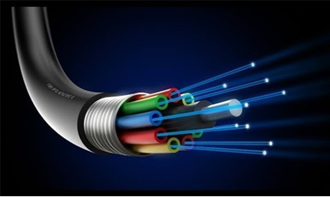
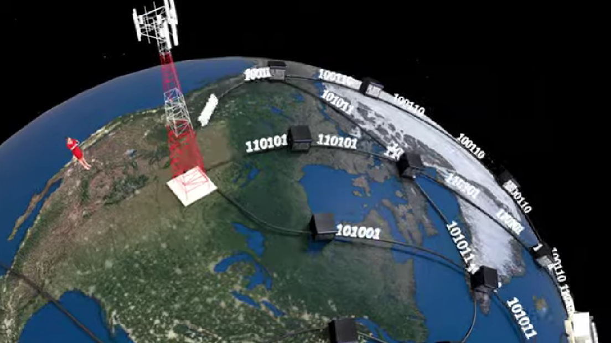
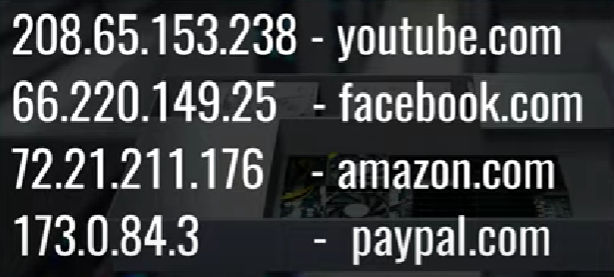

 

# 인터넷은 어떻게 작동하는가?

## 목차

 

1. [인터넷이란?](#-인터넷이란-?)
2. [데이터의 전달](#-데이터의-전달)
3. [라우터](#-라우터)
4. [IP](#-IP)
5. [참고](#-참고)

 

---

## 인터넷이란?

 

> - Internet  
>
> 1. 전 세계의 컴퓨터가 서로 연결되어 정보를 교환할 수 있는, 하나의 거대한 컴퓨터 통신망

 

결국 인터넷은 컴퓨터 간에 정보를 교환할 수 있는 거대한 통신망을 뜻한다.
그렇다면 컴퓨터는 인터넷 환경 속에서 어떻게 정보를 전달할 수 있을까?

 

---

 

## 데이터의 전달

 

일단 먼저 데이터가 전달되기 위해서는 전달하고 싶은 데이터가 저장되어야 한다. 데이터는 데이터 센터에 저장되어 있다. 저장된 데이터를 전달하는 방법은 여러 가지가 있다. 위성과 안테나를 이용하는 방법도 하나의 방법이 될 수 있다. 하지만 현실 세계에서 데이터 전달은 광섬유 케이블을 통해 이루어지고 있다.

 

인터넷을 통해 데이터를 전달하기 위해서는 광섬유 케이블을 이용해야 한다.

 

    
    

그런데 여기서 문제가 있다. 데이터 센터에 저장되어 있는 데이터를 나만 원하는 것이 아니지 않은가. 수십억의 사람들이 데이터 센터의 데이터를 얻기 위해서는 수십억 개의 각기 다른 광섬유 케이블이 있어야 한다는 소리다. 여기서 더 나아가 각기 다른 컴퓨터를 연결하려면 또 다른 광섬유 케이블이 수십억 개가 필요할 것이다.

이 복잡한 상황을 해결하기 위해 만들어진 것이 라우터다.

 

---

 

## 라우터

 

    
    

 수많은 케이블을 서로 연결하는 것보다는 수많은 케이블을 하나의 지점에서 컨트롤하고 정보를 정리해서 분산하는 것이 더 효율적인 방식이다. 그렇기에 라우터는 데이터 센터(혹은 다른 라우터)에서 넘어온 정보를 필요한 클라이언트에게 보내준다.

데이터 센터가 광섬유 케이블을 이용해 라우터로 정보를 보내고 라우터에 정보를 갈무리해서 클라이언트에게 보내는 것까지는 알겠다. 그런데 데이터 센터 속에 들어 있는 수많은 데이터 중에서 내가 원하는 데이터만 골라서 표시할 수 있는 이유는 무엇일까? 이를 파악하기 위해서는 IP에 대해서 알아야 한다.

 

---

 

## IP

 

IP는 인터넷을 통해 데이터를 전달받는 모든 기기가 가지고 있는 고유한 식별 번호다. 따라서 우리가 특정한 데이터를 원한다고 서버에 요청을 하면 서버는 해당하는 데이터를 요청한 기기의 IP 주소에 보낸다.

그런데 아마 여기까지 글을 읽었다면 이런 의문을 가질 것이다.

 

> '나는 특정 데이터의 IP를 달라고 요청해 본 적이 없는데?'

 

맞다. 나도 그런 적이 없다. 만약 그래야 했다면 인터넷을 사용하지 않았을 것이다.

네이버를 사용하기 위해 네이버를 주소창에 쳤다면 컴퓨터는 네이버에 해당하는 IP 주소를 서버에 요청하게 된다. 

 

    

 

이런 식으로 우리에게 친숙한 언어와 IP 주소는 1 대 1로 대응되어 있다. 그리고 이러한 정보가 저장되어 있는 것을 DNS라고 한다. (DNS에 대해서는 다음번에 자세히 다루겠다.)

주소창에 네이버를 입력했을 때 일어나는 일련의 과정을 정리하면 다음과 같다.

 

> 1. 네이버 입력
> 2. DNS에서 네이버에 해당하는 IP 주소 식별
> 3. 식별된 IP 주소를 서버에 전달
> 4. 서버에서 해당 IP 주소 데이터를 찾아 라우터(or기지국)에 전송
> 5. 라우터에서 해당 데이터를 클라이언트에게 전송
> 6. 웹 브라우저에 네이버 출력

 

---

 

## 참고

 

> MDN - https://developer.mozilla.org/ko/docs/Learn/Common_questions/How_does_the_Internet_work

> 인터넷은 어떻게 작동될까요? - https://www.youtube.com/watch?v=o5yBl59wRbY&t=157s
