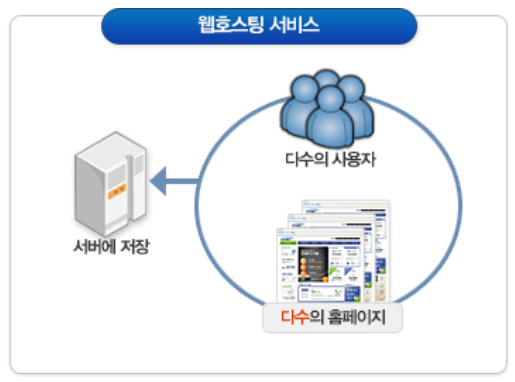
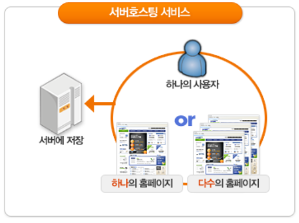
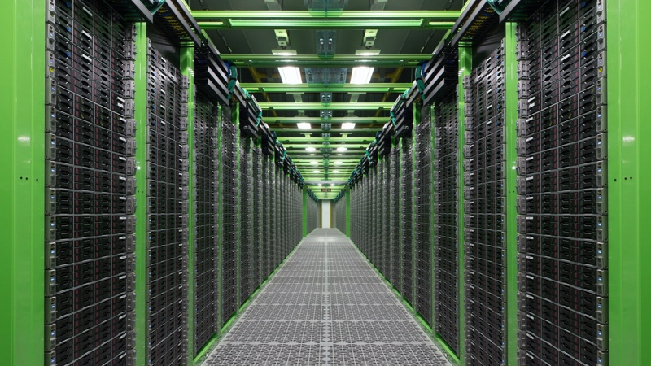
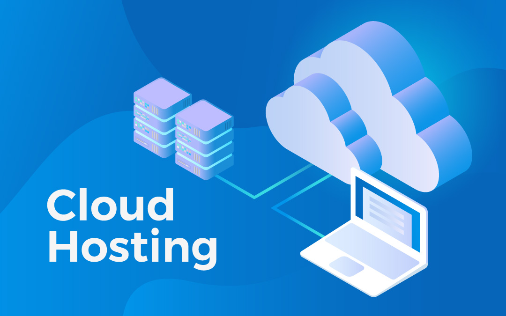

# 호스팅(Hosting)이란 뭘까?

 

## 목차

 

1. [호스팅이란?](#-호스팅이란-?)
2. [웹 호스팅](#-웹-호스팅)
3. [서버 호스팅](#-서버-호스팅)
4. [클라우드 호스팅](#-클라우트-호스팅)
5. [정리](#-정리-)

 

---

 

## 호스팅(Hosting)이란?

 
일단 Host라는 단어를 알아보자. Host는 네이버 영어사전에 의하면

 

> - Host  
>
> 1. (행사를) 주최하다
> 2. (TV라디오 프로를)진행하다
> 3. (파티를) 주최하다[열다]

 

즉, Hosting이라는 뜻은 주최하거나 진행한다는 의미를 띄고 있으며 이 뜻에 서비스가 맞닿게 되면 어떤 서비스를 주최하여 제공한다는 뜻으로 연결될 수 있다. 그렇다면 기업들은 클라이언트들에게 어떤 서비스들을 주최하여 제공할까? 그것은 바로 웹, 서버, 클라우드가 있다.

 

---

 

## 웹 호스팅

 

    

 

웹호스팅은 대형 통신업체나 전문회사가 자신들의 웹서버를 개인 또는 개별업체에 제공하거나 임대해 주는 것이라고 한다. - 두산백과 -

쉽게 말해 웹 애플리케이션을 운영 하기 위한 모든 것을 제공하는 서비스를 뜻한다. 여기서 모든 것은 서버(하드웨어, 운영체제 등), 인터넷, 애플리케이션을 작동하기 위해 필요한 데이터베이스 등을 뜻한다.   
결국 웹 호스팅 서비스를 제공 받는 사용자는 자신이 만든 애플리케이션을 업로드 하기만 하면 서버에서 자연스럽게 작동하는 것을 기대할 수 있다는 것이다.

 

장점

- 쉽고 저렴하다.
- 웹 사이트만 만들면 된다.

단점

- 웹 사이트를 운영하는데만 쓸 수 있다.
- 한 대의 컴퓨터를 다른 사람과 공유할 수 있기 때문에 다른 사람 사이트가 대박이 나면 자신의 사이트가 느려질 수 있다.

 

 주 사용자는 회사 홈페이지, 커뮤니티, 블로그와 같은 소규모 웹사이트에서 이용한다.

 

---

 

## 서버 호스팅

 

    

 

서버 호스팅은 간단히 얘기해 서버 컴퓨터 하나를 클라이언트에게 온전히 제공하는 것을 뜻한다. 서버 호스팅은 웹 호스팅과는 다르게 서버 컴퓨터 하나를 제외한 나머지 것들은 아무것도 제공하지 않는다. (임대형 서비스는 아니다.) 따라서 서버 컴퓨터 하나에 어떤 짓을 할지는 당신에게 달렸다.

 

장점

- 어떤 짓을 해도 된다. 즉 자유도가 높다.
- 잘 활용할 경우 서버의 모든 자원을 활용하여 보안상의 이점을 가질 수 있다.

단점

- 어떤 짓도 못 할 수 있다. 즉 서비스를 직접 운영해야 한다. ~~자유엔 책임이 따른단다.~~ 다만 서버 호스팅 중에서도 임대형 서비스를 선택할 경우 이 단점은 해당되지 않을 수 있다.
- 비싸다.

 

 주 사용자는 회사 인트라넷이나 대형 쇼핑몰과 같은 대용량 트레픽이 발생하고 보안이 중요한 곳에서 주로 사용된다.

 

    

~~저 컴퓨터들 중 하나를 빌릴 수 있단 말이지~~

 

---

 

## 클라우드 호스팅

 

구름 호스팅? 이상한 단어가 나왔다. 단어부터 파해쳐보자.

 

> - Cloud  
>
> 1. 구름
> 2. 흐리다
> 3. 어두워지다
> 4. 클라우드(온라인 저장 서비스)

 

분명 어릴 적만 해도 클라우드는 구름 밖에 몰랐는데 어느샌가 클라우드라는 단어 속에 온라인 저장 서비스라는 정의가 사전에 당당히 등재되어있다. 나도 모르는 사이 뭔가 일어나긴 했나 보다.

 나도 모르는 사이 벌어진 일이 무엇인지 파악하려면 클라우드 호스팅 서비스 개념 속의 두 가지 개념을 먼저 알아야 한다. 바로 가상화와 종량제이다.

 먼저 가상화라는 개념은 가상머신이라는 개념과 맞닿아 있다. 가상머신이란 실제로 물리적인 컴퓨터는 아닌데 마치 물리적인 컴퓨터처럼 작동하는 가상의 기계라고 간단하게 정의할 수 있다. 이러한 가상머신은 하나의 컴퓨터에 운영체제를 설치하고 그 운영체제 안에 여러 개의 운영체제를 운영할 수 있는 소프트웨어를 뜻한다. 이렇게 되면 하나의 실제 컴퓨터에 여러 개의 운영체제를 설치할 수 있게 된다.

~~왜냐면 컴퓨터에 설치된 가상머신이 여러 개의 운영체제를 계속해서 작동하게 도와주니까.~~

즉 가상머신이라는 개념은 물리적인 컴퓨터는 하나인데 마치 여러 개의 컴퓨터가 작동하는 것과 같은 효과를 누릴 수 있게 만들어 주는 소프트웨어이고 이를 가상화라고 한다.

이것이 호스팅 산업에 어떤 파괴력을 가져오는지는 종량제 개념이 적절하게 버무려지면서 나타나게 된다.

 

    

~~아직까지는 뜬구름 잡는 이야기 같은데~~

 

 사실 종량제라는 개념은 별 것 없다. 종량제 봉투의 그 종량제 맞다. 쓰레기를 많이 배출하는 만큼 많은 비용을 발생시키는 제도. 하지만 이 새로울 것 없는 제도는 가상머신과 맞물리면서 획기적인 비즈니스 모델을 제시하게 된다.

 가상화로 인해 우리는 가상의 컴퓨터를 만들 수 있게 되었다. 이는 사용자에게 딱 필요한 컴퓨터를 제공할 수 있게 되었다는 이야기다. 예를 들어 자그마한 웹 사이트를 만들어 운영하고 싶다면 예전에는 웹 호스팅을 이용했어야 했다. 실제 내 웹 사이트는 정말 극소량의 리소스만 필요한데도 웹 호스팅 서비스는 그보다 더 많은 양을 제공하면서 그에 걸맞는 돈을 받아갔다. 이렇게 얘기하면 업체가 날강도처럼 느껴지겠지만 업체 입장에서는 어쩔 수 없다. 당신이 원하는 규모의 컴퓨터는 너무 작아서 구하고 싶어도 구할 수 없기 때문이다.

 
 하지만 가상머신은 간단하게 이를 해결한다. 그냥 가상으로 극소량의 운영체제를 만들면 된다. 그리고 업체는 그 사용량 만큼만 돈을 받으면 된다. 소비자는 필요한 리소스 만큼의 가격만 지불하면 되니 좋고 공급자는 필요한 리소스만 정확하게 제공하고 여분의 리소스는 다른 곳에 활용할 수 있으니 좋은 것이다. 이것은 정확히 반대의 효과도 가져다 주는데 내가 어마어마한 리소스가 필요하다면 우리는 물리적인 컴퓨터를 엄청나게 준비했어야 했다. 하지만 이제는 소비자도 업체도 그럴 필요가 없어졌다. 바로 이것이 종량제와 가상화의 맞물림 효과다. 

 간략하게 정리하면 클라우드 호스팅이란 컴퓨터 속에 또 다른 컴퓨터를 만들어서 클라이언트에게 필요한 양만큼의 리소스를 제공하는 서비스를 뜻한다. 

 

장점

- 유연한 리소스 활용 가능성으로 가동 시간은 거의 99.9% 보장된다.
- 탄력적인 비용으로 인해 저렴하게 사용할 수 있다.

단점

- 유연한 리소스 활용 가능성은 보안에 대한 이슈를 만들어 낼 수 있다.
- 탄력적인 비용으로 인해 더 비싸게 사용할 수도 있다.

 

---

 

## 정리

 

호스팅에 대해 간단하게 알아봤다. 호스팅은 여러가지 형태의 서비스가 있기에 장점과 단점을 살펴 보고 자신의 상황에 맞게 선택하는 자세가 필요할 것이다.
